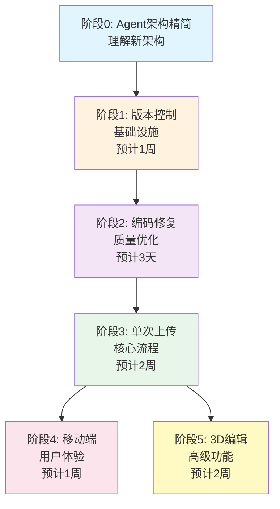

# Yilite 系统升级技术方案 V10 (重组版)

## 📋 目录

- [需求清单](#需求清单与解决方案映射)
- [执行路线图](#执行路线图)
- [阶段0：Agent架构精简](#阶段0agent架构精简前置准备)
- [阶段1：版本控制与草稿发布](#阶段1版本控制与草稿发布基础设施)
- [阶段2：STEP转GLB编码修复](#阶段2step转glb编码修复质量优化)
- [阶段3：智能识别与单次上传](#阶段3智能识别与单次上传核心流程)
- [阶段4：移动端适配](#阶段4移动端适配用户体验)
- [阶段5：3D模型动态编辑](#阶段53d模型动态编辑高级功能)
- [输出目录结构](#输出目录结构)

---

## 需求清单与解决方案映射

| # | 需求 | 解决方案 | 所属阶段 | 优先级 |
|---|------|---------|---------|--------|
| 6 | 版本控制 | Draft/Publish机制(仅发布时生成版本) | 阶段1 | P0 |
| 8 | 修改描述 | 新增描述编辑tab，保存到draft，发布时才生效 | 阶段1 | P0 |
| 5 | 真实文件名 | PDF文件名=task_id=项目名，废弃"组件1" | 阶段3 | P0 |
| 9 | BOM序号顺序 | 修改Agent 3/4提示词，强制按BOM seq排序 | 阶段3 | P0 |
| - | 中文乱码 | STEP转GLB编码检测与修复 | 阶段2 | P1 |
| 1 | 手机查看 | 增强版响应式 + 滑动手势 + 底部大按钮 + 自动播放 | 阶段4 | P1 |
| 3 | 爆炸视图逐步显示 | 控制Mesh.visible，每步累加显示零件 | 阶段4 | P1 |
| 7 | 自动播放 | setInterval定时切换步骤 | 阶段4 | P1 |
| 2 | 插入新模型 | MVP半自动绑定: 上传->选步骤->手动对齐->写入草稿 | 阶段5 | P2 |
| 4 | 自动转STEP | 暂缓 | - | - |

---

## 执行路线图



**关键依赖关系：**
- 阶段1是所有后续阶段的基础（提供数据存储机制）
- 阶段2可与阶段3并行，但建议先完成（避免生成乱码数据）
- 阶段3完成后，阶段4和阶段5可并行开发
- 总预计时间：5-6周（串行），4周（部分并行）

---

## 阶段0：Agent架构精简（前置准备）

> **目标**：理解新架构，为后续开发做准备
> **依赖**：无
> **预计时间**：1天（学习理解）
> **验收标准**：团队成员理解新架构的数据流和各组件职责

### 0.1 当前架构 (6 Agents)

```
Agent1(视觉规划) -> Agent2(BOM-3D) -> Agent3(组件装配) -> Agent4(产品总装) -> Agent5(焊接) -> Agent6(安全)
```

**问题**：
- Agent1调用AI成本高，但实际只是按BOM序号排序
- Agent5功能可以合并到Agent3/4的提示词中
- 中间文件过多，维护复杂

### 0.2 新架构 (SimplePlanner + 4 Agents)

```
SimplePlanner(替代Agent1) -> Agent2(BOM-3D) -> Agent3或Agent4 -> Agent6(安全)
```

**变更说明**:

- **Agent1 -> SimplePlanner**: 用代码自动生成planning_result，不再调用AI
  - 基准件 = BOM序号第一的零件（seq=1）
  - 装配顺序 = 严格按照BOM序号从小到大
  - 基准组件 = BOM序号最小的组焊件

- **保留 Agent2**: BOM-3D匹配是3D高亮的核心

- **保留 Agent3**: 组件内部零件的焊接装配步骤
  - 合并Agent5焊接工艺到提示词到agent3

- **保留 Agent4**: 产品级组件拼装步骤

- **保留 Agent6**: 安全FAQ整合到assembly_manual.json

**优势**：
- 降低AI调用成本
- 简化数据流
- 提高可维护性
- 根据用户需求，遵循实际工程制图标准（BOM序号即装配顺序）

### 0.3 SimplePlanner实现方案

**问题**: 删除Agent1后，后续流程依赖的字段会缺失:

- `component_assembly_plan` (组件列表、基准件、装配顺序)
- `product_assembly_plan` (产品名、基准组件)

**解决**: 新增 `core/simple_planner.py`（在阶段3实现）

```python
import json
from typing import Dict, List
from pathlib import Path
from datetime import datetime

class SimplePlanner:
    """
    简化的规划生成器 - 替代Agent1

    核心原则（工程制图标准）：
    - 基准件 = BOM序号第一的零件（seq=1）
    - 基准组件 = BOM序号最小的组焊件
    - 装配顺序 = 严格按照BOM序号从小到大
    """
    
    def generate_component_plan(self, pdf_name: str, bom_data: list) -> dict:
        """
        为组件图生成规划（替代Agent1对组件的规划）

        核心规则（工程制图标准）：
        1. 基准件 = BOM序号第一的零件（seq=1）
        2. 装配顺序 = BOM序号顺序

        Args:
            pdf_name: PDF文件名（作为组件名）
            bom_data: BOM数据列表

        Returns:
            兼容Agent1输出格式的planning_result
        """
        if not bom_data:
            raise ValueError(f"BOM数据为空: {pdf_name}")

        # ✅ 按seq排序（确保顺序正确）
        sorted_bom = sorted(bom_data, key=lambda x: int(x.get("seq", 999)))

        # ✅ 序号1就是基准件（工程标准，不是按重量）
        base_part = sorted_bom[0]

        # 验证基准件信息完整性
        if not base_part.get("code") or not base_part.get("name"):
            raise ValueError(f"基准件信息不完整: {base_part}")

        return {
            "success": True,
            "component_assembly_plan": [{
                "component_code": pdf_name,
                "component_name": pdf_name,
                "assembly_order": 1,
                "drawing_number": "1",
                "base_part_code": base_part.get("code", ""),
                "base_part_name": base_part.get("name", ""),
                "base_part_seq": base_part.get("seq", "1"),  # ✅ 记录BOM序号
                "base_part_material": base_part.get("material", ""),
                "base_part_quantity": base_part.get("quantity", 1),
                "assembly_steps": []  # Agent3会按BOM序号生成步骤
            }],
            "product_assembly_plan": {},
            "metadata": {
                "total_parts": len(sorted_bom),
                "bom_sequence": [item.get("seq") for item in sorted_bom],
                "generated_by": "SimplePlanner",
                "generation_time": datetime.now().isoformat()
            }
        }
    
    def generate_product_plan(self, pdf_name: str, bom_data: list) -> dict:
        """
        为产品总图生成规划（替代Agent1对产品的规划）

        核心规则（工程制图标准）：
        1. 基准组件 = BOM序号最小的组焊件
        2. 装配顺序 = BOM序号顺序

        Args:
            pdf_name: PDF文件名
            bom_data: BOM数据列表（包含组焊件）

        Returns:
            兼容Agent1输出格式的planning_result
        """
        # 按seq排序
        sorted_bom = sorted(bom_data, key=lambda x: int(x.get("seq", 999)))

        # 找出所有组焊件
        sub_assemblies = [
            item for item in sorted_bom
            if self._is_sub_assembly(item)
        ]

        if not sub_assemblies:
            raise ValueError(f"产品总图中未找到组焊件: {pdf_name}")

        # ✅ 序号最小的组焊件作为基准组件（工程标准，不是按重量）
        base_component = sub_assemblies[0]

        # 生成组件装配计划（按BOM序号排序）
        component_plans = []
        for i, comp in enumerate(sub_assemblies, 1):
            component_plans.append({
                "component_code": comp.get("code", ""),
                "component_name": comp.get("name", ""),
                "assembly_order": i,
                "drawing_number": str(i),
                "bom_seq": comp.get("seq", "")  # ✅ 保留原始BOM序号
            })

        return {
            "success": True,
            "component_assembly_plan": component_plans,
            "product_assembly_plan": {
                "product_name": pdf_name,
                "base_component_code": base_component.get("code", ""),
                "base_component_name": base_component.get("name", ""),
                "base_component_seq": base_component.get("seq", "1"),  # ✅ 记录BOM序号
                "assembly_sequence": []  # Agent4会按BOM序号生成步骤
            },
            "metadata": {
                "total_components": len(sub_assemblies),
                "total_parts": len(sorted_bom),
                "bom_sequence": [item.get("seq") for item in sorted_bom],
                "generated_by": "SimplePlanner",
                "generation_time": datetime.now().isoformat()
            }
        }

    def _is_sub_assembly(self, bom_item: dict) -> bool:
        """判断是否为组焊件"""
        material = bom_item.get("material", "").lower()
        name = bom_item.get("name", "").lower()

        # 关键词匹配
        keywords = ["组焊件", "组件", "assembly", "assy", "weldment"]
        return any(kw in material or kw in name for kw in keywords)
```

**调用时机**: generate_single接口中，根据文件类型调用对应方法（详见阶段3）

### 0.4 中间文件变化

| 旧文件名 | 新架构处理 |
|---------|-----------|
| step1_file_hierarchy.json | ❌ 删除 |
| step2_bom_data.json | ✅ 保留为 `bom_data.json` |
| step3_planning_result.json | ✅ 保留为 `planning_result.json` (SimplePlanner生成) |
| step4_matching_result.json | ✅ 保留为 `matching_result.json` |
| step5/6_*.json | ✅ 保留为 `agent_output.json` |
| step7_enhanced_*.json | ❌ 删除 |

### 0.5 新架构输出目录结构

```
output/{pdf文件名}/                    # task_id = PDF文件名（去后缀）
├── assembly_manual.json              # ✅ 已发布版本（工人查看）
├── draft.json                        # ✅ 草稿版本（编辑器使用）
├── versions/                         # ✅ 版本归档目录
│   ├── v1.json                       #    版本1
│   ├── v2.json                       #    版本2
│   └── version_history.json          #    版本历史元数据
├── planning_result.json              # 📋 SimplePlanner生成（替代Agent1）
├── bom_data.json                     #[object Object]取结果
├── matching_result.[object Object]OM-3D匹配结果
├── agent_output.json                 # 📋 Agent原始输出
├── glb_files/                        # 🎨 3D模型文件
│   ├── part_001.glb
│   ├── part_002.glb
│   └── assembly.glb
├── pdf_images/                       # 📄 PDF转图片
│   ├── page_1.png
│   └── page_2.png
├── pdf_files/                        # 📄 原始PDF文件
│   └── {task_id}.pdf
├── step_files/                       # 📄 原始STEP文件
│   └── {task_id}.step
└── assets/                           # 🎨 外部上传的模型（阶段5）
    ├── extra_model_1.glb
    └── extra_model_2.glb
```

**文件说明**：

| 文件 | 用途 | 生成时机 | 使用者 |
|------|------|---------|--------|
| `assembly_manual.json` | 已发布的装配手册 | 点击[发布]按钮 | 工人（ManualViewer） |
| `draft.json` | 草稿版本 | 点击[保存草稿]按钮 | 管理员（ManualEditor） |
| `versions/v*.json` | 历史版本归档 | 每次发布自动生成 | 版本回溯 |
| `planning_result.json` | 装配规划 | SimplePlanner自动生成 | Agent2/3/4输入 |
| `bom_data.json` | BOM数据 | PDF解析时生成 | SimplePlanner输入 |
| `matching_result.json` | BOM-3D匹配 | Agent2生成 | Agent3/4输入 |
| `agent_output.json` | Agent原始输出 | Agent3/4/6生成 | 调试和审计 |
| `glb_files/` | 3D模型 | STEP转换时生成 | 前端3D查看器 |
| `assets/` | 外部模型 | 用户上传 | 前端3D查看器 |

**数据流向**：

```
PDF + STEP
    ↓
[BOM提取] → bom_data.json
    ↓
[SimplePlanner] → planning_result.json
    ↓
[Agent2] → matching_result.json
    ↓
[Agent3/4] → agent_output.json
    ↓
[整合] → draft.json
    ↓
[发布] → assembly_manual.json + versions/v{n}.json
```

---

## 阶段1：版本控制与草稿发布（基础设施）

> **目标**：建立稳定的数据存储和版本管理机制
> **依赖**：无
> **预计时间**：1周
> **验收标准**：
> - ✅ 支持草稿保存和发布
> - ✅ 自动生成版本历史
> - ✅ 前端分离查看和编辑页面
> - ✅ 支持步骤描述编辑
> - ✅ 旧数据自动迁移

### 1.1 旧数据迁移 (自动)

**触发条件**: assembly_manual.json存在 且 versions/不存在

**迁移动作**:
1. 创建versions/目录
2. 为现有数据添加version字段
3. 归档为v1.json
4. 添加迁移日志

### 1.2 ManualStorage类 (core/storage.py)

```python
class ManualStorage:
    """装配手册存储管理器"""

    def __init__(self, task_id: str):
        self.task_id = task_id
        self.output_dir = Path(f"output/{task_id}")
        self.versions_dir = self.output_dir / "versions"

    def get_published(self) -> dict:
        """获取已发布版本（工人查看）"""

    def get_draft(self) -> dict:
        """获取草稿（编辑者编辑）"""

    def save_draft(self, data: dict) -> None:
        """保存草稿（不生成版本）"""

    def publish(self, changelog: str = "") -> str:
        """发布草稿（生成新版本）"""

    def discard_draft(self) -> None:
        """放弃草稿修改"""

    def get_version_history(self) -> List[dict]:
        """获取版本历史列表"""

    def get_version(self, version: str) -> dict:
        """获取指定版本"""

    def _migrate_old_data(self) -> None:
        """自动迁移旧数据"""
```

### 1.3 API接口

```python
# simple_app.py 新增接口

GET  /api/manual/{task_id}/view              # 获取已发布版本
GET  /api/manual/{task_id}/edit              # 获取草稿
POST /api/manual/{task_id}/save              # 保存草稿
POST /api/manual/{task_id}/publish           # 发布（生成版本）
POST /api/manual/{task_id}/discard           # 放弃草稿
GET  /api/manual/{task_id}/history           # 版本历史
GET  /api/manual/{task_id}/version/{v}       # 获取指定版本
```

### 1.4 前端双页面

**ManualViewer.vue (工人查看)**
- 只读模式
- 调用 `/api/manual/{task_id}/view`
- 显示已发布的稳定版本
- 无编辑按钮

**ManualEditor.vue (管理员编辑)**
- 可编辑模式
- 调用 `/api/manual/{task_id}/edit`
- 显示草稿版本
- 提供 [保存草稿] [发布] [放弃修改] 按钮
- 显示版本历史

### 1.5 描述编辑功能 (需求8)

在ManualEditor.vue的编辑Dialog中新增"步骤描述"tab：

```javascript
// 数据结构
editData: {
  description: '',  // 新增字段
  parts: [],
  // ...其他字段
}

// Tab切换
editActiveTab: 'description'  // 默认显示描述tab

// 加载步骤数据
loadStepData(step) {
  this.editData.description = step.description || ''
  // ...
}

// 保存步骤数据
saveStep() {
  currentStep.description = this.editData.description
  // ...
}
```

### 1.6 任务清单

- [ ] **[Backend]** 创建 `core/storage.py` 实现 ManualStorage 类
- [ ] **[Backend]** 实现旧数据自动迁移逻辑
- [ ] **[Backend]** 改造 `simple_app.py` 新增版本控制相关接口
- [ ] **[Frontend]** 拆分 ManualViewer 为 Viewer 和 Editor 页面
- [ ] **[Frontend]** Editor页面增加版本历史和发布按钮
- [ ] **[Frontend]** Editor页面新增步骤描述编辑tab
- [ ] **[Testing]** 测试草稿保存和发布流程
- [ ] **[Testing]** 测试旧数据迁移功能

---

## 阶段2：STEP转GLB编码修复（质量优化）

> **目标**：解决STEP文件转GLB时中文名称乱码问题
> **依赖**：无（独立技术优化）
> **预计时间**：3天
> **验收标准**：
> - ✅ 自动检测STEP文件编码
> - ✅ 正确转换中文名称
> - ✅ GLB文件中中文显示正常
> - ✅ 有降级处理机制

### 2.1 核心规则

- 一次上传: 1个PDF + 1个STEP
- task_id = PDF文件名(去后缀)

### 2.2 文件类型判断

```python
def identify_file_type(pdf_path, bom_data):
    if "组件" in filename: return "component"
    if any("组焊件" in x.get("material","") for x in bom_data): return "product"
    return "component"
```

### 2.3 生成流程

```
upload_single -> 提取BOM -> identify_file_type -> 返回识别结果
generate_single -> SimplePlanner生成planning -> Agent2/3或4 -> Agent6 -> 整合
```

### 2.4 Agent提示词修改 (需求9)

修改Agent3/4提示词，强制按BOM序号排序
修改agent3的提示词，明确组件图都是数据焊接步骤，每个零件之间都是焊接。
修改agent4的提示词，明确产品总图之间的零件都是拼装步骤，每个组件零件之间都是零件连接起来的，而不是焊接。

---


## 阶段3：智能识别与单次上传（核心流程）

> **目标**：实现单文件入口的智能流程，替代繁琐的多步骤上传
> **依赖**：阶段1、阶段2
> **预计时间**：2周
> **验收标准**：
> - ✅ 单一上传入口，自动识别文件类型
> - ✅ 强制按BOM序号排序
> - ✅ 完整生成流程跑通

### 3.1 核心规则

- 一次上传: 1个PDF + 1个STEP
- task_id = PDF文件名(去后缀)

### 3.2 文件类型判断

```python
def identify_file_type(pdf_path, bom_data):
    if "组件" in filename: return "component"
    if any("组焊件" in x.get("material","") for x in bom_data): return "product"
    return "component"
```
### 3.3 生成流程
upload_single -> 提取BOM -> identify_file_type -> 返回识别结果
generate_single -> SimplePlanner生成planning -> Agent2/3或4 -> Agent6 -> 整合

### 3.4 Agent提示词修改 (需求9)
修改Agent3/4提示词，强制按BOM序号排序 修改agent3的提示词，明确组件图都是数据焊接步骤，每个零件之间都是焊接。 修改agent4的提示词，明确产品总图之间的零件都是拼装步骤，每个组件零件之间都是零件连接起来的，而不是焊接。


## 阶段4：移动端适配（用户体验）

> **目标**：优化移动端浏览体验
> **依赖**：阶段3
> **预计时间**：1周

### 4.1 增强版响应式布局

- 检测isMobile (window.innerWidth < 768)
- 手机端隐藏左侧图纸栏，3D+描述全屏显示
- 底部超大按钮导航（上一步/下一步）

### 4.2 滑动手势切换

- 使用原生touch事件或hammer.js库
- 左滑 -> 下一步
- 右滑 -> 上一步

### 4.3 自动播放

- setInterval定时切换步骤
- 可配置播放间隔（默认5秒）
- 播放/暂停按钮

### 4.4 逐步显示 (需求3)

- 控制Mesh.visible
- 每步只显示当前步骤涉及的零件
- 颜色从三色变成二色（已显示/未显示）

---

## 阶段5：3D模型动态编辑（高级功能）

> **目标**：支持在3D场景中动态添加和调整外部模型
> **依赖**：阶段3
> **预计时间**：2周

### 5.1 附加外部模型 (MVP)

交互流程：

1. 点击"添加外部模型"按钮
2. 上传GLB/STEP -> 保存到assets/
3. 弹窗填写: 模型名称、BOM序号、关联步骤
4. TransformControls拖拽对齐
5. 确认 -> 写入draft.json
6. [保存草稿] -> [发布]

数据结构：

```json
{
  "step_number": 5,
  "external_models": [{
    "url": "/api/manual/{task_id}/assets/extra.glb",
    "name": "额外支架",
    "bom_seq": "99",
    "matrix": [16个数字的变换矩阵],
    "visible_from_step": 5
  }]
}
```


### 5.2 插入新步骤 (进阶，可选)

- 在步骤之间插入新步骤
- 自动重新编号后续步骤
- 复杂度高，建议阶段5的MVP稳定后再实现

---

## 输出目录结构
output/{pdf文件名}/                    # task_id = PDF文件名（去后缀）
├── assembly_manual.json              # ✅ 已发布版本（工人查看）
├── draft.json                        # ✅ 草稿版本（编辑器使用）
├── versions/                         # ✅ 版本归档目录
│   ├── v1.json                       #    版本1
│   ├── v2.json                       #    版本2
│   └── version_history.json          #    版本历史元数据
├── planning_result.json              # 📋 SimplePlanner生成（替代Agent1）
├── bom_data.json                     #[object Object]取结果
├── matching_result.[object Object]OM-3D匹配结果
├── agent_output.json                 # 📋 Agent原始输出
├── glb_files/                        # 🎨 3D模型文件
│   ├── part_001.glb
│   ├── part_002.glb
│   └── assembly.glb
├── pdf_images/                       # 📄 PDF转图片
│   ├── page_1.png
│   └── page_2.png
├── pdf_files/                        # 📄 原始PDF文件
│   └── {task_id}.pdf
├── step_files/                       # 📄 原始STEP文件
│   └── {task_id}.step
└── assets/                           # 🎨 外部上传的模型（阶段5）
    ├── extra_model_1.glb
    └── extra_model_2.glb


---

## 执行清单

### Phase 1: 版本控制
- [ ] [Backend] 创建 core/storage.py 实现 ManualStorage 类 (含迁移逻辑)
- [ ] [Backend] 改造 simple_app.py 新增版本API
- [ ] [Frontend] 拆分 ManualViewer 为 Viewer 和 Editor 页面
- [ ] [Frontend] Editor页面增加版本历史和发布按钮
- [ ] [Frontend] Editor页面新增"步骤描述"编辑tab (需求8)
- [ ] [Testing] 测试旧数据迁移功能

### Phase 2: STEP转GLB编码修复
- [ ] [Backend] 实现 StepToGlbConverter 类
- [ ] [Backend] 集成 chardet 库进行编码检测
- [ ] [Backend] 测试各种编码的STEP文件转换
- [ ] [Backend] 实现 GlbNameFixer 类
- [ ] [Backend] 测试GLB文件结构解析和修改
- [ ] [Backend] 验证修复后的GLB文件完整性
- [ ] [Backend] 在 gemini_pipeline.py 中集成编码修复流程
- [ ] [Backend] 添加降级处理机制
- [ ] [Testing] 完整流程测试

### Phase 3: 智能识别与单次上传
- [ ] [Backend] 新增 core/simple_planner.py (替代Agent1)
- [ ] [Backend] 重构 file_classifier.py 增加BOM内容分析
- [ ] [Backend] 新增 upload_single/generate_single 接口
- [ ] [Frontend] 改造 Generator.vue 为单文件上传UI
- [ ] [Prompt] 修改 Agent3/4 提示词强制BOM序号排序

### Phase 4: 移动端适配
- [ ] [Frontend] ManualViewer 增加手机端专属布局
- [ ] [Frontend] 实现滑动手势切换步骤
- [ ] [Frontend] 添加底部大按钮导航
- [ ] [Frontend] 实现自动播放功能
- [ ] [Frontend] ThreeViewer 实现逐步显示逻辑

### Phase 5: 3D模型动态编辑
- [ ] [Backend] 后端资产上传接口
- [ ] [Frontend] 前端TransformControls集成
- [ ] [Frontend] external_models数据保存与回显
- [ ] [Frontend] (可选) 步骤插入与重新编号逻辑


